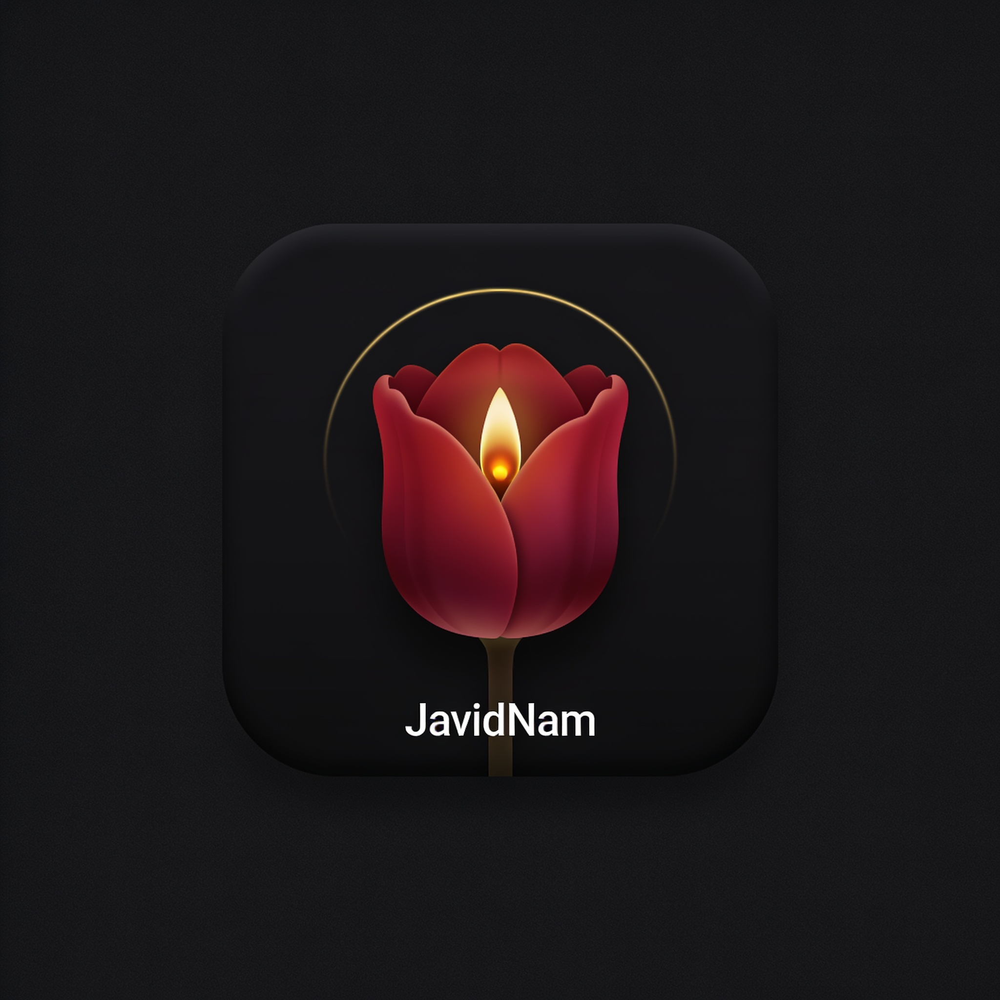

<div dir="rtl">

# 🕯 جاویدنام | JavidNam

<p align="center">
  
</p>

<p align="center">
  <b>پنل مدیریت اشتراک VLESS/Trojan روی Cloudflare Workers — بدون سرور، بدون هزینه، بدون تبلیغ</b>
</p>

<p align="center">
  
  
  
  
</p>

> **«به یاد جان‌باختگان ۱۸ و ۱۹ دی ۱۴۰۴ — نامشان جاوید»**
>
> این پروژه در یادمان قربانیان کشتار ۱۸ و ۱۹ دی‌ماه ۱۴۰۴ ساخته شده است؛
> کسانی که برای آزادی پای ایستادند و نامشان در حافظه‌ی ما جاوید می‌ماند.

---


## 🚀 نسخه ۲.۰ — چه چیزهایی اضافه شد

| قابلیت | توضیح |
|---|---|
| 🌍 **تا ۱۶ لوکیشن + انتخاب تا ۸ لوکیشن برای هر کاربر** | هر لوکیشن = آدرس ورودی + مسیر خروجی (direct / proxyip / socks5) |
| 🔀 **Failover خودکار خروجی** | direct → outbound لوکیشن → ProxyIP سراسری → استخر VIP (round-robin + cooldown مسیرهای خراب) |
| 🧊 **IP تمیز با چرخش خودکار** | لیست IP تمیز، N آی‌پی در هر ساب، چرخش هر N دقیقه |
| 🎭 **uTLS Fingerprint + Fragment + SNI/Host Mask** | chrome/safari/firefox/ios/android/edge/random + پریست اپراتور (MCI/ایرانسل/رایتل/مخابرات/شاتل/گیمینگ) |
| 🧠 **مسیر هوش مصنوعی** | دامنه‌های Gemini/ChatGPT/Claude/… از استخر VIP یا SOCKS5 دلخواه |
| 🛡 **مسدودکننده تبلیغات و محتوای بزرگسال برای هر کاربر** | DoH (AdGuard / Cloudflare Family) بدون نیاز به سرور |
| ⚖️ **محدودیت تعداد اتصال + IP هم‌زمان + ریست خودکار** | و شروع شمارش از اولین اتصال |
| 📦 **ساخت گروهی کاربر + عملیات گروهی کامل** | تمدید، افزودن حجم، لوکیشن، فیلتر، ریست، حذف |
| 📊 **مانیتور سهمیه‌ی ۱۰۰k کلودفلر + نمودار ۳۰ روزه + آنلاین‌ها** | داخل داشبورد |
| 📡 **ابزارها: پینگ زنده، تست مستقیم، تست استخر پروکسی، اسکنر IP تمیز (Python/CMD/Bash + مرورگر)** | |
| 🔄 **آپدیت OTA از داخل پنل** | علاوه بر بات |
| 📲 **PWA** | نصب مثل اپ روی موبایل/دسکتاپ |
| 🔗 **ساب چندفرمتی** | raw / base64 / Clash-Mihomo YAML / sing-box JSON / JSON status + تشخیص خودکار کلاینت + دیپ‌لینک Hiddify/v2rayNG/Streisand/sing-box/Clash/Shadowrocket |
| 📄 **صفحه‌ی وضعیت زنده‌ی هر کاربر** (`/status/<token>`) | حلقه‌ی مصرف، روز مانده، دستگاه‌های آنلاین |
| 🎨 **UI جدید AMOLED** | پس‌زمینه‌ی متحرک، ریسپانسیو کامل، منوی پایین موبایل |


## ✨ امکانات

**🚀 هسته‌ی پروکسی (کاملاً اوریجینال)**
- 📡 پشتیبانی هم‌زمان **VLESS** و **Trojan** روی WebSocket با TLS
- 🧠 مدیریت هوشمند اتصال: TCP + رله‌ی DNS-over-HTTPS برای UDP پورت ۵۳
- ⚡ حساب‌رسانی ترافیک با بافر isolate و flush بهینه (حداقل کوئری D1، حداکثر سرعت)
- 🛡 مسیر WebSocket تصادفی per-install برای هر پنل (ضد اسکن)

**👥 مدیریت کاربران**
- 📊 سهمیه بر اساس **حجم (GB)**، **زمان (روز)**، و **محدودیت IP همزمان**
- ⏳ گزینه‌ی **«شروع شمارش با اولین اتصال»** — اشتراک از اولین استفاده فعال می‌شود
- ♻️ **ریست خودکار دوره‌ای** مصرف (مثلاً هر ۷۲۰ ساعت)
- 🛠 عملیات گروهی: فعال/غیرفعال، ریست مصرف، حذف دسته‌ای
- 🔄 **آپدیت OTA بدون از دست رفتن داده** — از طریق بات تلگرام

**📱 پنل ساب منحصربه‌فرد**
- 🌙 طراحی یادبود AMOLED تیره، راست‌چین، بدون هیچ وابستگی خارجی (فونت/CDN/تبلیغ = صفر)
- 📱 QR Code برای هر کانفیگ + کپی یک‌کلیکی + لینک ساب استاندارد (v2rayNG/Hiddify/Streisand/…)
- 🇮🇷 تب‌های بهینه‌سازی اپراتور: **همراه اول / ایرانسل / رایتل / تلکام / گیمینگ** با تنظیم fragment خودکار
- 📊 نمایش زنده‌ی مصرف، روزهای باقی‌مانده و تاریخ جلالی
- 📲 PWA — روی گوشی مثل اپ نصب می‌شود

**🤖 بات دیپلوی تلگرام**
- ☁️ ساخت خودکار پنل روی **اکانت کلودفلر خودِ کاربر** (D1 + Workers + دامنه)
- 👥 مدیریت چند اکانت کلودفلر به‌طور هم‌زمان
- 🔄 آپدیت، ریست رمز، وضعیت و حذف پنل‌ها از داخل تلگرام
- 🔐 توکن‌ها **رمزنگاری‌شده (AES-GCM)** ذخیره می‌شوند و پیام حاوی توکن بلافاصله حذف می‌گردد

**🗄 زیرساخت**
- ☁️ تمام‌وکمال روی **Cloudflare Free Tier** (Workers + D1)
- 🔐 رمز مدیریت با SHA-256 نمک‌دار + قفل brute-force (بن ۱۵ دقیقه بعد از ۵ خطا)
- 💾 پشتیبان‌گیری کامل JSON (خروجی/ورودی)
- 📦 سورس تک‌فایله و بدون وابستگی — استقرار با کپی‌پیست هم ممکن است

---

## 🚀 راه‌اندازی

### روش ۱: بات تلگرام (پیشنهادی — ۲ دقیقه)

1. در کلودفلر یک توکن API بساز ([راهنمای دقیق](docs/DEPLOY.md#توکن-کلودفلر)) با دسترسی‌های:
   - `Account · Workers Scripts : Edit`
   - `Account · D1 : Edit`
   - `Account · Account Settings : Read`
2. به بات دیپلویر جاویدنام در تلگرام برو و `/start` بزن
3. «👤 حساب‌های Cloudflare» → توکن را بفرست
4. «🚀 ساخت پنل جدید» → حسابت را انتخاب کن
5. آدرس پنل + رمز مدیریت را تحویل بگیر. تمام! 🌷

### روش ۲: استقرار دستی

مرحله‌به‌مرحله در [docs/DEPLOY.md](docs/DEPLOY.md) — خلاصه:

1. در داشبورد کلودفلر: Workers & Pages → Create Worker
2. محتوای [`panel/javidnam-worker.js`](panel/javidnam-worker.js) را جای‌گذاری و Deploy کن
3. یک دیتابیس D1 بساز و به ورکر بایند کن (نام بایند: `DB`)
4. متغیرهای `ADMIN_PASS_HASH` و `SESSION_SECRET` را اضافه کن (برای ساخت هش [docs/DEPLOY.md](docs/DEPLOY.md))
5. اولین ورود → ساخت کاربر → دادن لینک ساب 🎉

---

## 📖 راهنمای سریع کاربران

| پلتفرم | روش |
|---|---|
| **اندروید** | v2rayNG یا Hiddify → افزودن اشتراک → لینک ساب را وارد کن |
| **iOS** | Streisand / V2Box → Copy from clipboard یا اسکن QR |
| **ویندوز/مک** | v2rayN / Hiddify → Import from clipboard |

لینک ساب هر کاربر به‌صورت خودکار با تغییر تنظیمات پنل به‌روز می‌شود؛ کاربر نیاز به کانفیگ جدید ندارد.

---

## 🏗 معماری

```
┌──────────────┐   webhook   ┌──────────────────┐
│  Telegram    │◄───────────►│  javidnam-bot    │  ← بات دیپلوی (ورکر مستقل)
└──────────────┘             └────────┬─────────┘
                                      │ Cloudflare API
                     ┌────────────────▼────────────────┐
                     │   javidnam-panel-* (Workers)    │  ← پنل‌های کاربران
                     │  ┌───────────────────────────┐  │
                     │  │ /          → پنل مدیریت    │  │
                     │  │ /sub/:token → پنل ساب      │  │
                     │  │ /jvn-xxxx  → پروکسی WS     │  │
                     │  │ /api/*     → API مدیریت    │  │
                     │  └───────────────────────────┘  │
                     └───────────────┬─────────────────┘
                                     │ SQL
                              ┌──────▼──────┐
                              │  D1 (SQLite)│
                              └─────────────┘
```

- `panel/src/` — سورس ماژولار پنل (هسته، پروکسی، API، ساب، روتر)
- `panel/assets/` — رابط‌های کاربری (ادمین + ساب)
- `panel/build.mjs` — اسکریپت build (خروجی: تک‌فایل قابل دیپلوی)
- `bot/javidnam-bot.js` — بات دیپلوی تلگرام
- `preview/` — پیش‌نمایش استاتیک UI بدون نیاز به سرور

## 🧪 تست

```bash
cd panel && node build.mjs && node test-core.mjs
```

پارسرهای VLESS/Trojan، SHA-224، فریم‌بندی UDP و تبدیل تاریخ جلالی با تست‌های خودکار پوشش داده شده‌اند.

تست انتها-به-انته (اتصال واقعی VLESS/Trojan از طریق WSS به پنل دیپلوی‌شده):

```bash
PANEL_HOST="پنل-تو.workers.dev" PROXY_PATH="/jvn-..." TEST_UUID="uuid-کاربر" node panel/test-e2e.mjs
```

### ⚠️ محدودیت شناخته‌شده‌ی پلتفرم (مربوط به همه‌ی پنل‌های ورکری)

سوکت‌های TCP ورکرهای کلودفلر **نمی‌توانند به رنج‌های IP خود Cloudflare وصل شوند**؛ بنابراین سایت‌هایی که مستقیماً روی edge کلودفلر سرو می‌شوند (مثل `discord.com` یا `example.com`) از طریق تونل باز نمی‌شوند. این محدودیت در **تمام** پنل‌های مبتنی بر Worker (از جمله پنل‌های مشابه) یکسان است و ربطی به این پیاده‌سازی ندارد. گوگل، یوتیوب، اینستاگرام، تلگرام، ویکی‌پدیا و اکثر سایت‌ها بدون مشکل کار می‌کنند. برای دسترسی به سایت‌های CF-fronted می‌توان از یک هاب واسط (VPS) استفاده کرد.

---

## ⚖️ لایسنس و اعتبارها

- این پروژه تحت **GPL-3.0** منتشر می‌شود — کد آزاد است؛ نام و یادبود آن محفوظ.
- تولید QR در پنل ساب: [`qrcode-generator` 1.4.4](https://github.com/kazuhikoarase/qrcode-generator) (MIT)
- این پروژه **کد هیچ پنل دیگری را کپی نکرده** و پیاده‌سازی آن از صفر و اوریجینال است.

## 🛡 یادبود

```
   ۱۸ و ۱۹ دی ۱۴۰۴
   ─────────────────
   نامشان جاوید
```

</div>

---

## JavidNam (English)

A fully original, ad-free VLESS/Trojan subscription panel for Cloudflare Workers, with a Telegram deployer bot that provisions panels on users' own Cloudflare accounts. Built in memory of those killed on 18–19 Dey 1404 (January 8–9, 2026). See the Persian README above for features and setup, or [docs/DEPLOY.md](docs/DEPLOY.md).

**License:** GPL-3.0 · **Zero external dependencies** · **No ads, no tracking**

## نسخه ۲.۱ — طراحی جدید بنفش + رفع باگ پینگ

- 🎨 **طراحی کاملاً جدید**: مینیمال، مدرن، پالت بنفش (مثل ZEUS/پاسارگاد) — نوار بالای دکمه‌های گرد نئونی، کارت‌های آماری رنگی، جدول کاربران با دکمه‌های 🚀 (کپی کانفیگ مستقیم) 🌍 (لوکیشن‌ها و ساب) ⚡ (صفحه‌ی وضعیت).
- 🧠 یادمان «۱۸ و ۱۹ دی ۱۴۰۴» فقط به‌صورت یک خط آرام در فوتر — بدون فضای غمگین.
- 🐛 **رفع باگ «کانفیگ پینگ نمی‌دهد»**:
  - پشتیبانی از **Early-Data** (`?ed=2048` در هدر `Sec-WebSocket-Protocol`) که xray/v2rayNG/Hiddify استفاده می‌کنند و قبلاً نادیده گرفته می‌شد.
  - رفع گم‌شدن اولین پاسخ سرور در بعضی مقصدها (probe read رها می‌شد).
  - ProxyIP پیش‌فرض برای مقصدهای پشت کلودفلر (ورکر نمی‌تواند مستقیم به IPهای کلودفلر وصل شود) + استخر ProxyIP با failover.
  - IPهای تمیز پیش‌فرض واقعی (`www.speedtest.net`, `104.16.1.1`, …) به‌جای آدرس‌های شبکه‌ی `.0`.
  - ALPN پیش‌فرض `http/1.1` (وب‌سوکت روی h2 در کلاینت‌ها کار نمی‌کند).
- ✅ تست E2E با **Xray واقعی** (v26) روی همه‌ی لوکیشن‌ها: Google 204، ipify، Cloudflare trace، Discord — همه OK.

